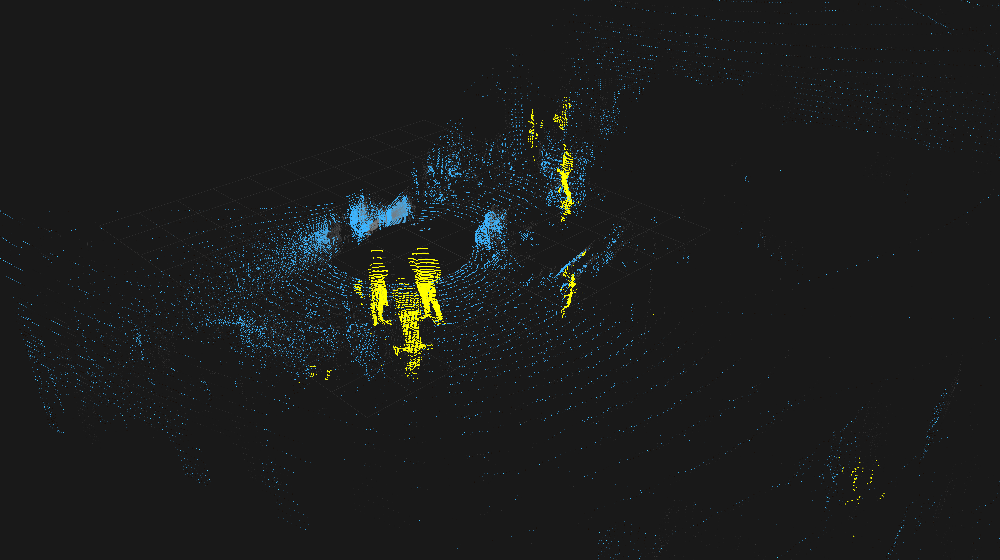

# LIPEDE

LIPEDE (LiDAR PEople DEtector) provides online and offline ROS 2 Python nodes
that use LARS/LSK3DNet to detect people and remove their points from Ouster
clouds. The online node processes live clouds from `/ouster/points` and publishes
the filtered environment and detected people on `/ouster/points/processed` and
`/ouster/points/people`. The offline node sequentially processes every cloud in
a recorded ROS 2 bag and writes a complete people-free output bag for later use.

The ROS package name is `lipede` because ROS 2 package names cannot contain
hyphens.



*LIPEDE in RViz: the filtered environment cloud is shown in blue and
detected people are highlighted in yellow.*

## AUTOSWEEP USAGE

Launch the fast-lipede ros2 node:
- lipede() {
    cd /home/autosweep/lipede_ws || return
    source install/setup.bash
    source .venv/bin/activate
    export PYTHONPATH="$VIRTUAL_ENV/lib/python3.12/site-packages${PYTHONPATH:+:$PYTHONPATH}"
    cd ..
    ros2 launch lipede lipede.launch.py
  }

Luanch a SLAM algorithm like GLIM:
- glim() {
    source /home/autosweep/glim_ws/install/setup.bash
    ros2 run glim_ros glim_rosnode glim_rosbag /home/autosweep/autosweep/dataset22jul/coverage1_lipede \
      --ros-args \
      -p config_path:=/home/autosweep/glim_ws/src/glim/config \
      -p dump_path:=/home/autosweep/glim_maps/my_map \
      -r /ouster/points:=/ouster/points/processed
  }
  - ros2 run glim_ros glim_rosnode \
      --ros-args \
      -p config_path:=/home/autosweep/glim_ws/src/glim/config \
      -p dump_path:=/home/autosweep/glim_maps/my_map


Play the bag:
- jazzy
- ros2 bag play   /home/autosweep/autosweep/dataset22jul/coverage1 

## Data path through the node

For each `sensor_msgs/msg/PointCloud2` message, the node:

1. Creates NumPy views for the `x`, `y`, `z`, and `intensity` fields directly
   over the ROS message buffer. The fields may have arbitrary byte offsets and
   the message may contain additional Ouster fields.
2. Builds the model's contiguous `float32` `[x, y, z, intensity]` array. This is
   the only unavoidable representation conversion before preprocessing; no
   temporary `.bin` file is written.
3. Removes invalid points and applies the training crop (`x/y` within 50 m and
   `z` between -4 and 4 m), normalizes intensity, and computes the same
   range-image normals used by `test_autosweep.py`.
4. Runs exactly one inference (`model.eval()` plus `torch.inference_mode()`).
5. Removes model classes listed in `people_class_ids`. The default is `[16, 17]`,
   corresponding to the person/followers and kid-like learned categories for
   the 21-class AutoSweep model. Confirm these IDs against the label mapping
   used to train your checkpoint.
6. Splits the original point records into two complementary messages:
   `/ouster/points/processed` contains everything except people, while
   `/ouster/points/people` contains only positive people detections.
7. Copies every selected original `point_step`-byte record byte-for-byte. Thus
   timestamps, frame ID, field layout, and all retained Ouster point attributes
   are preserved exactly. Width, row step, and data length necessarily change.
   Both outputs are unorganized (`height=1`) clouds.

Points outside the model crop are retained because the network cannot classify
them. If processing fails, the original message is published by default.

## Included inference files

- `models/model_8rwkv.0pth`: copied LARS checkpoint.
- `config/model.yaml`: minimal architecture and crop configuration.
- `vendor/network`: model, voxelization, RWKV, and TorchSparse compatibility
  implementation required by the checkpoint.
- `vendor/utils`: checkpoint loader and range-normal preprocessing only.
- `vendor/c_utils`: the normal-map C++ source/build definition and the existing
  Python 3.11 compiled extension. A vectorized NumPy fallback is used if its ABI
  does not match the ROS Python interpreter.

The checked-in `.so` is Python/architecture specific. Rebuild it when the target
does not use CPython 3.11 x86-64.

## Requirements

- ROS 2 with `rclpy`, `sensor_msgs`, and `ament_python`
- Python 3.11 for the included fast normal extension, or use/rebuild the fallback
- CUDA-capable GPU and CUDA-enabled PyTorch
- `numpy`, `PyYAML`, OpenCV, `torch-scatter`, and TorchSparse

The model stack is not installed automatically by `colcon`. Install versions
compatible with the CUDA/PyTorch environment used by the original LARS project.

## Build

From a ROS 2 workspace (this repository can be the workspace source directory,
or this folder can be linked under `src`):

```bash
source /opt/ros/$ROS_DISTRO/setup.bash
cd /path/to/ros2_ws
colcon build --symlink-install --packages-select lipede
source install/setup.bash
```

For a conventional workspace layout:

```bash
mkdir -p ~/lipede_ws/src
ln -s /path/to/LARS/LIPEDE ~/lipede_ws/src/LIPEDE
cd ~/lipede_ws
colcon build --symlink-install --packages-select lipede
source install/setup.bash
```

## Processing modes

LIPEDE provides two modes that use the same neural network and point-cloud
filtering code, but handle incoming data differently.

### Real-time mode

Real-time mode is intended for a live LiDAR or for cases where immediate output
is more important than processing every scan. It is the default mode.

```text
LiDAR or ros2 bag play
        |
        v
 /ouster/points
        |
        v
 LIPEDE inference
        |------------------------------|
        v                              v
 /ouster/points/processed     /ouster/points/people
 environment without people       detected people
```

The node subscribes to `input_topic`, processes each cloud when its callback is
scheduled, and immediately publishes two complementary clouds:

- `output_topic` contains all original points except those classified as people;
- `people_topic` contains only the points classified as people.

The subscriber uses best-effort QoS with a queue depth of one. Consequently,
the node always favors the newest available scan: if the sensor or bag publishes
faster than inference can run, intermediate clouds can be dropped instead of
creating an increasingly delayed backlog. This is desirable for live viewing,
but it is not suitable when every scan must be preserved for later SLAM.

Start real-time mode with:

```bash
ros2 launch lipede lipede.launch.py mode:=real_time
```

Then start the sensor or play a bag normally:

```bash
ros2 bag play /path/to/input_bag
```

Real-time mode does not create a new bag automatically. Record the desired
topics separately with `ros2 bag record` if needed.

### Offline mode

Offline mode is intended for preparing a complete people-free dataset before
running SLAM. It does not subscribe to a separately played bag. Instead, the
offline node opens the bag through `rosbag2_py`, reads one record at a time, and
runs inference sequentially. It therefore processes every point cloud regardless
of how long inference takes.

```text
 input bag
    |
    | sequential read (no real-time deadline)
    v
 point-cloud record? -- no --> copy serialized record unchanged
    |
   yes
    |
    v
 detect and remove people
    |
    v
 write filtered cloud at the original bag time
    |
    v
 <input_bag>_lipede
```

The resulting bag is created beside the input bag by default. For example:

```text
/data/coverage1              input
/data/coverage1_lipede  output
```

The output has the same topic set as the input. Records on `input_topic` are
replaced with their filtered clouds; all other records are copied in serialized
form without deserializing or modifying them. For each filtered cloud, offline
mode preserves:

- the original rosbag publication timestamp;
- `header.stamp` and `header.frame_id`;
- the original `PointField` definitions and retained point bytes;
- the relative ordering of all bag records.

Only the cloud geometry metadata that must change after removing points is
updated: the result is an unorganized cloud (`height=1`) with a new `width`,
`row_step`, and data length.

While conversion is running, the node also publishes the original cloud,
filtered cloud, and people-only cloud on the configured visualization topics.
The existing RViz configuration can therefore be used without modification.
These live visualization messages are not added as extra topics to the output
bag; the original point-cloud topic itself contains the corrected data.

Run offline conversion with:

```bash
ros2 launch lipede lipede.launch.py \
  mode:=offline \
  bag_path:=/home/autosweep/autosweep/dataset22jul/coverage1
```

Do not run `ros2 bag play` at the same time. The offline node is the bag reader
and exits after the complete output bag has been written. A custom destination
can be selected with `output_bag_path`:

```bash
ros2 launch lipede lipede.launch.py \
  mode:=offline \
  bag_path:=/data/coverage1 \
  output_bag_path:=/data/coverage1_people_free
```

To protect existing datasets, conversion fails if the output path already
exists. Pass `overwrite_output:=true` only when replacing that output is
intentional. If inference fails for an individual cloud and
`passthrough_on_error` is enabled, that cloud is copied unchanged and the error
is reported in the conversion summary.

After conversion, use the generated bag as a normal input to GLIM or another
SLAM system:

```bash
ros2 bag play /data/coverage1_lipede
```

### Mode comparison

| Property | Real-time | Offline |
|---|---|---|
| Input | ROS topic | Bag path |
| Processing rate | Constrained by live publication | As fast as inference allows |
| Can skip clouds | Yes, when input is faster than inference | No |
| Output | Two live ROS topics | New bag plus visualization topics |
| Bag timestamps preserved | Not applicable unless separately recorded | Yes |
| Recommended use | Live monitoring and immediate filtering | Complete preprocessing before SLAM |

## Run the node only

```bash
ros2 run lipede lipede_node
```

## Launch the node and RViz

```bash
ros2 launch lipede lipede.launch.py
```

The included RViz YAML configuration displays:

- `/ouster/points` in translucent gray;
- `/ouster/points/people` in yellow with larger points;
- `/ouster/points/processed` in blue, initially disabled to avoid visually
  covering the gray input. Enable it in the RViz Displays panel when needed.

The default RViz fixed frame is `os_sensor`. If the incoming cloud uses another
`header.frame_id`, change **Global Options → Fixed Frame** and the view's target
frame in RViz, then save the configuration if desired.

Launch arguments can override the node topics and device:

```bash
ros2 launch lipede lipede.launch.py \
  mode:=real_time \
  input_topic:=/ouster/points \
  output_topic:=/ouster/points/processed \
  people_topic:=/ouster/points/people \
  device:=cuda
```

The launch file also applies these topic overrides as RViz remappings.

Useful parameters:

```bash
ros2 run lipede lipede_node --ros-args \
  -p input_topic:=/ouster/points \
  -p output_topic:=/ouster/points/processed \
  -p people_topic:=/ouster/points/people \
  -p intensity_field:=intensity \
  -p people_class_ids:="[16,17]" \
  -p device:=cuda
```

If the Ouster driver exposes reflectivity under another field name, set
`intensity_field`, for example `-p intensity_field:=reflectivity`. The numerical
distribution must match the intensity feature used during training for good
predictions.

Other parameters:

| Parameter | Default | Purpose |
|---|---|---|
| `config_path` | installed `config/model.yaml` | Model architecture and crop |
| `checkpoint_path` | installed checkpoint | Override model weights |
| `passthrough_on_error` | `true` | Publish the unchanged input after an error |

## Validate the stream

```bash
ros2 topic hz /ouster/points/processed
ros2 topic hz /ouster/points/people
ros2 topic echo /ouster/points/processed --once
```

The node uses sensor-data-style best-effort QoS with queue depth 1. This favors
fresh scans and bounds backlog during real-time operation. ROS Python callbacks
are synchronous, so an incoming scan may be dropped by DDS while inference is
busy rather than accumulating latency.

## Optional `.bin` representation

The model input is equivalent to a SemanticKITTI-style `.bin` file:

```python
xyzi.astype(np.float32).tofile("scan.bin")
```

LIPEDE deliberately does not perform this disk write. It passes the same
`N x 4` values directly to preprocessing, avoiding filesystem latency and a
second read/copy.

## Performance notes

- Keep `people_class_ids` short; filtering uses one vectorized comparison.
- The first scan is slower due to CUDA initialization and allocator warm-up.
- Rebuild the normal-map extension for maximum throughput if the node reports a
  Python ABI mismatch; the portable vectorized fallback is slower.
- Latency is logged at most once per second.
- Input fields are viewed without conversion. A compact output buffer must be
  allocated because deleting arbitrary point records cannot be represented as a
  zero-copy `PointCloud2` message.
